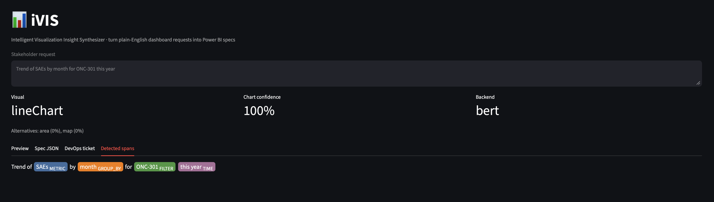
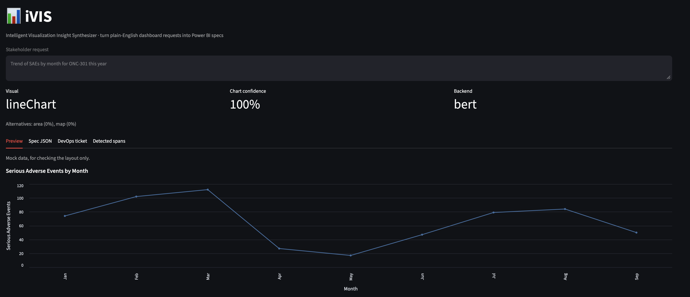
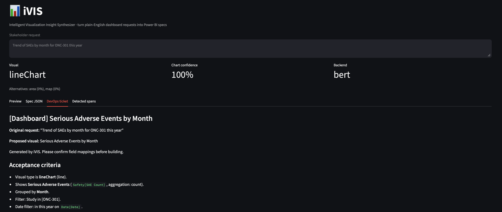
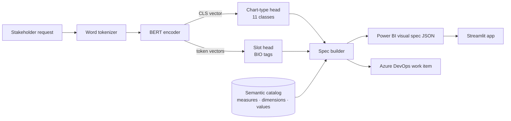

# iVIS: Intelligent Visualization Insight Synthesizer

[](https://github.com/FabcanK6/ivis/actions/workflows/tests.yml)
[](https://ivis-fabcank6.streamlit.app)
[](https://huggingface.co/FabcanK6/ivis-bert)

**[▶ Try the live demo](https://ivis-fabcank6.streamlit.app)**

**Turn plain-English dashboard requests into Power BI visual specs.**

Clinical stakeholders tend to ask for dashboards in loose terms, for example *"Can we get a chart of top queries by site?"*, and a BI developer then has to work out the chart type, measure, axis, filters and date window. iVIS does that step automatically. A fine-tuned BERT model reads the request and returns a structured, Power BI-ready spec plus a DevOps work item.

iVIS is Phase 1 of **Project NOVAQ** (Narrative-to-Operational Value & Analytics Quotient), which turns unstructured clinical and operational narratives into structured outputs.

```text
"Can we get a chart of the top 10 sites with the most open queries in Germany over the last 30 days?"
                                            │
                                            ▼
 chart: bar → clusteredBarChart     measure: Queries[Query Count] (count)
 axis:  Site[Site Name]             filters: Queries[Status] = open, Site[Country] = Germany
 top N: 10 by Query Count (desc)    date:    InLast 30 Days on Date[Date]
```

---

## Demo

**Request:** *"Trend of SAEs by month for ONC-301 this year"*

BERT tags each part of the request:



and iVIS turns it into a Power BI line chart spec (preview uses mock data):



plus a ready-to-file DevOps ticket:



---

## How it works



iVIS treats the task as **joint intent classification + slot filling** (the "JointBERT" set-up):

| Component | What it does |
|---|---|
| **Chart-type head** | Classifies the request into one of 11 visuals: `bar`, `stacked_bar`, `line`, `area`, `pie`, `donut`, `table`, `matrix`, `card`, `scatter`, `map`. |
| **Slot head** | Tags each word with BIO labels for `METRIC`, `AGG`, `GROUP_BY`, `SERIES`, `FILTER`, `TIME`, `TOPN`, `SORT`. |
| **Semantic catalog** (`ivis/catalog.py`) | Maps detected spans to real fields, e.g. "open queries" → `Queries[Query Count]` + filter `Queries[Status] = open`. |
| **Spec builder** (`ivis/spec.py`) | Normalizes time windows into Power BI relative-date filters, resolves top-N and sort, applies chart-specific defaults (a line chart with no axis gets `Date[Month]`), fills the visual's field wells and lists anything it couldn't resolve under `warnings`. |
| **Rule baseline** (`ivis/rules.py`) | The original keyword/lexicon parser. Used as a baseline for evaluation and as a fallback when there's no trained checkpoint. |

The model only decides *what was asked for*, and the catalog decides *which fields that means*. To point iVIS at your own dataset, edit the catalog and retrain. The model architecture doesn't change.

---

## Quickstart

```bash
git clone https://github.com/FabcanK6/ivis.git
cd ivis
python -m venv .venv && source .venv/bin/activate
pip install -r requirements.txt
```

**Try it immediately with the rule-based parser** (no training needed):

```bash
python -m ivis.cli --backend rules "how many screen failures do we have at Site 104 since January?"
python -m ivis.cli --backend rules --format devops "protocol deviations by country broken down by category in 2025"
streamlit run app/streamlit_app.py
```

**Train the BERT model:**

```bash
# 1. Generate synthetic training data (20k train / 2k val / 2k test)
python -m ivis.data.generate --out data

# 2. Fine-tune (GPU recommended; on CPU try --model prajjwal1/bert-tiny first)
python -m ivis.train --model bert-base-uncased --out models/ivis-bert --epochs 4

# 3. Evaluate on the test split and compare with the rule baseline
python -m ivis.evaluate --data data/test.jsonl --model models/ivis-bert
python -m ivis.evaluate --data data/test.jsonl --backend rules

# Or run all of the above:
./scripts/train_bert.sh
```

If you don't have a GPU, open `notebooks/train_on_colab.ipynb` in Google Colab with a T4 runtime.

Once `models/ivis-bert/` exists, both the CLI and the Streamlit app pick it up automatically. To use a different directory, set `IVIS_MODEL_DIR`.

### Other encoders

Any Hugging Face encoder with a fast tokenizer works with `--model`:

| Model | Notes |
|---|---|
| `bert-base-uncased` | Default. |
| `distilbert-base-uncased` | About 2× faster, slightly lower accuracy. |
| `prajjwal1/bert-tiny` | For CPU smoke tests. |
| `microsoft/BiomedNLP-BiomedBERT-base-uncased-abstract-fulltext` | Biomedical vocabulary; worth trying with real clinical requests. |
| `roberta-base` | Supported (`add_prefix_space` is handled for you). |

---

## Training data

Real stakeholder requests are scarce and often confidential, so iVIS starts from a **template-based synthetic generator** (`ivis/data/generate.py`):

* About 85 request templates across the 11 chart types. The phrasing is deliberately indirect ("is enrollment going up or down?", "what share of AEs comes from each country?"), so the model has to learn chart cues instead of looking for the word "pie".
* Slots are filled from the clinical-operations catalog: 14 measures (queries, SAEs, deviations, enrollment, SDV %, ...), 20 dimensions (site, country, study, CRA, visit, arm, ...), filter values, 25 time expressions, top-N phrases and sort words.
* Augmentation adds conversational prefixes and suffixes ("for the steering committee, ..."), random casing, dropped punctuation and occasional typos.
* **Held-out templates:** one template per chart type never appears in train/val. Half of the test set uses those templates, which measures generalization to unseen phrasing.

Each row looks like this:

```json
{"text": "show open queries by site in Germany last 30 days",
 "tokens": ["show", "open", "queries", "by", "site", "in", "Germany", "last", "30", "days"],
 "tags":   ["O", "B-FILTER", "B-METRIC", "O", "B-GROUP_BY", "O", "B-FILTER", "B-TIME", "I-TIME", "I-TIME"],
 "chart_type": "bar", "template_id": "bar/1"}
```

`data/sample.jsonl` has 150 example rows. Full splits are generated on demand and git-ignored.

**Adding real data:** append real requests in the same JSONL format to `data/train.jsonl`. Even a few hundred hand-labelled requests from real user stories will help the model more than additional synthetic data.

---

## Results

Test set: 2,000 requests. Half use phrasings seen during training; the other half come from 10 held-out templates the model never saw.

| Parser | Chart-type acc. | Slot micro-F1 | Exact frame match | Unseen phrasing (chart acc. / slot F1) |
|---|---|---|---|---|
| Rule baseline (`ivis/rules.py`) | **0.946** | 0.897 | 0.600 | **0.956** / 0.909 |
| BERT (`bert-base-uncased`, 4 epochs, Colab T4) | 0.926 | **0.954** | **0.796** | 0.853 / 0.906 |

*Exact frame match* means the chart type and every slot tag are correct.

| Slot F1 | AGG | FILTER | GROUP_BY | METRIC | SERIES | SORT | TIME | TOPN |
|---|---|---|---|---|---|---|---|---|
| Rules | 0.829 | 0.959 | 0.860 | 0.998 | 0.623 | 0.821 | 0.873 | 1.000 |
| BERT | 0.886 | 1.000 | 0.898 | 0.996 | 0.801 | 1.000 | 0.999 | 1.000 |

**What this shows**

- **BERT is much better at pulling out the details.** Exact frame match rises from 60% to 80%. The biggest gains are in telling the axis apart from the legend (SERIES 0.62 → 0.80), time windows (0.87 → 1.00) and sort order (0.82 → 1.00).
- **BERT partly memorizes phrasing.** It is near perfect on familiar wording (chart acc. 0.999, slot F1 1.000) but drops to 0.853 chart accuracy on unseen wording, below the rule baseline. Most of those misses are stacked bars ("X per Y split by Z" read as a plain bar, 0.48) and cards (0.85).
- **Some errors come from the labels, not the model.** For example, "total" is tagged as an aggregation in some templates but not in "contribution to total", and "over time" is never tagged as a time axis.

**Next improvements:** more varied phrasing in the generator, fixing label inconsistencies, falling back to rule-based chart cues when BERT is unsure, and evaluating on real stakeholder requests.

> Synthetic data overstates real-world accuracy. Before relying on these numbers, evaluate on a small hand-labelled set of real requests.
---

## Output spec

`parser.parse(text)` returns:

```jsonc
{
  "title": "Query Count by Site",
  "chart_type": "bar",
  "powerbi_visual": "clusteredBarChart",
  "measures":  [{"name": "Query Count", "field": "Queries[Query Count]", "aggregation": "count"}],
  "group_by":  [{"name": "Site", "field": "Site[Site Name]"}],
  "series":    [],
  "filters":   [{"field": "Queries[Status]", "operator": "In", "values": ["open"]},
                {"field": "Site[Country]",   "operator": "In", "values": ["Germany"]}],
  "time_filter": {"field": "Date[Date]", "filterType": "RelativeDate", "operator": "InLast",
                  "timeUnitsCount": 30, "timeUnit": "Days"},
  "top_n": {"n": 10, "direction": "desc", "by": "Query Count"},
  "sort":  {"by": "Query Count", "direction": "desc"},
  "field_wells": {"Category": ["Site[Site Name]"], "Y": ["Queries[Query Count]"]},
  "confidence": {"chart_type": 0.97, "alternatives": [{"chart_type": "table", "p": 0.02}]},
  "spans": [...],
  "warnings": []
}
```

`ivis.devops.to_json_patch(spec)` produces the body for the Azure DevOps *Create Work Item* REST call (`POST .../_apis/wit/workitems/$User%20Story?api-version=7.1`, content type `application/json-patch+json`). The work item includes the title, the original request, acceptance criteria and open questions.

---

## Python API

```python
from ivis.predict import load_parser
from ivis.devops import to_markdown

parser = load_parser("models/ivis-bert")      # falls back to the rule parser if the checkpoint is missing
spec = parser.parse("Trend of SAEs by month for ONC-301 this year")
print(spec["powerbi_visual"], spec["field_wells"])
print(to_markdown(spec))
```

---

## Repository layout

```
ivis/
├── ivis/
│   ├── schema.py          # chart types, slot labels, Power BI visual names
│   ├── catalog.py         # semantic model: measures, dimensions, values → Power BI fields
│   ├── text.py            # word tokenizer + BIO helpers
│   ├── data/
│   │   ├── templates.py   # request templates per chart type
│   │   └── generate.py    # synthetic dataset generator (train/val/test + held-out templates)
│   ├── model.py           # JointBERT: encoder + chart head + slot head, save/load
│   ├── train.py           # fine-tuning loop (AdamW, warmup, fp16, best-checkpoint saving)
│   ├── evaluate.py        # accuracy, span F1, seen vs unseen templates, error samples
│   ├── metrics.py         # span-level P/R/F1 (no seqeval dependency)
│   ├── predict.py         # BertParser / RuleBasedParser → spec
│   ├── spec.py            # spans → Power BI spec (time, top-N, sort, defaults, field wells)
│   ├── devops.py          # spec → Azure DevOps work item / markdown
│   ├── rules.py           # keyword baseline
│   └── cli.py             # `python -m ivis.cli "..."`
├── app/streamlit_app.py   # UI: preview with mock data, spec JSON, DevOps ticket, span highlighting
├── notebooks/train_on_colab.ipynb
├── scripts/train_bert.sh
├── tests/                 # unittest/pytest; model tests build a tiny random BERT (no download)
└── data/sample.jsonl
```

Run the tests with `pytest` or `python -m unittest discover -s tests`.

---

## Roadmap (Project NOVAQ)

- [x] **iVIS:** Narrative-to-Spec (this repo)
- [ ] Feedback capture in the app → corrected examples appended to training data
- [ ] Generate Power BI report JSON (PBIR `visual.json`) directly from the spec
- [ ] LLM fallback for low-confidence requests
- [ ] **SCOPE:** Narrative-to-Insight (risk extraction from SRM visit notes)
- [ ] Narrative-to-SQL
- [ ] Narrative-to-Audit

## License

MIT © Fabian Msafiri
